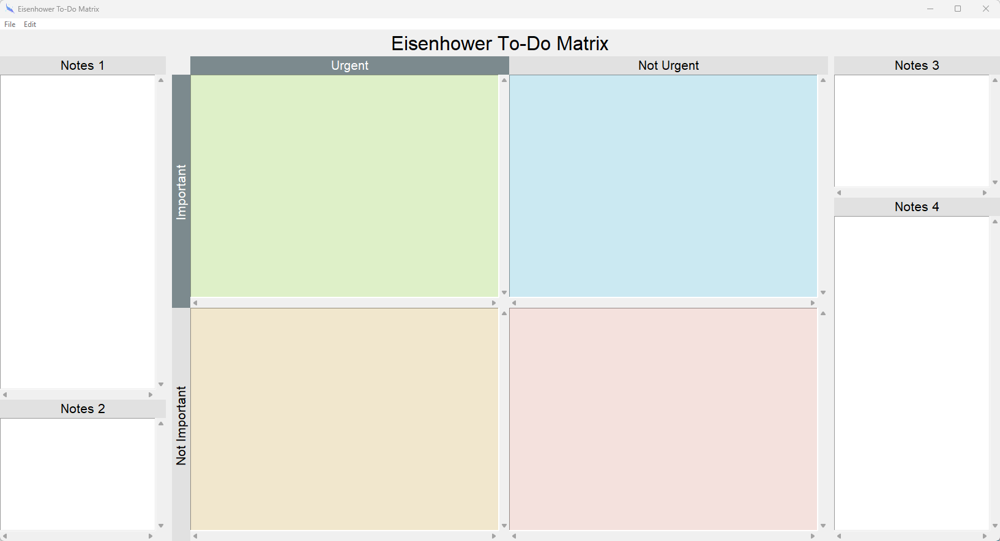
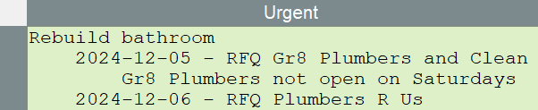
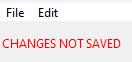
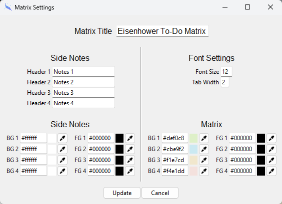
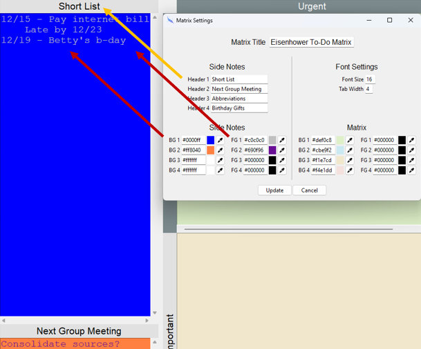
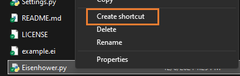
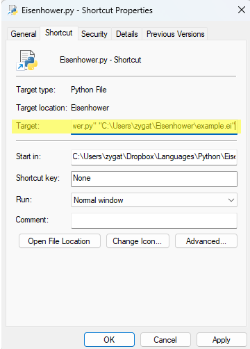
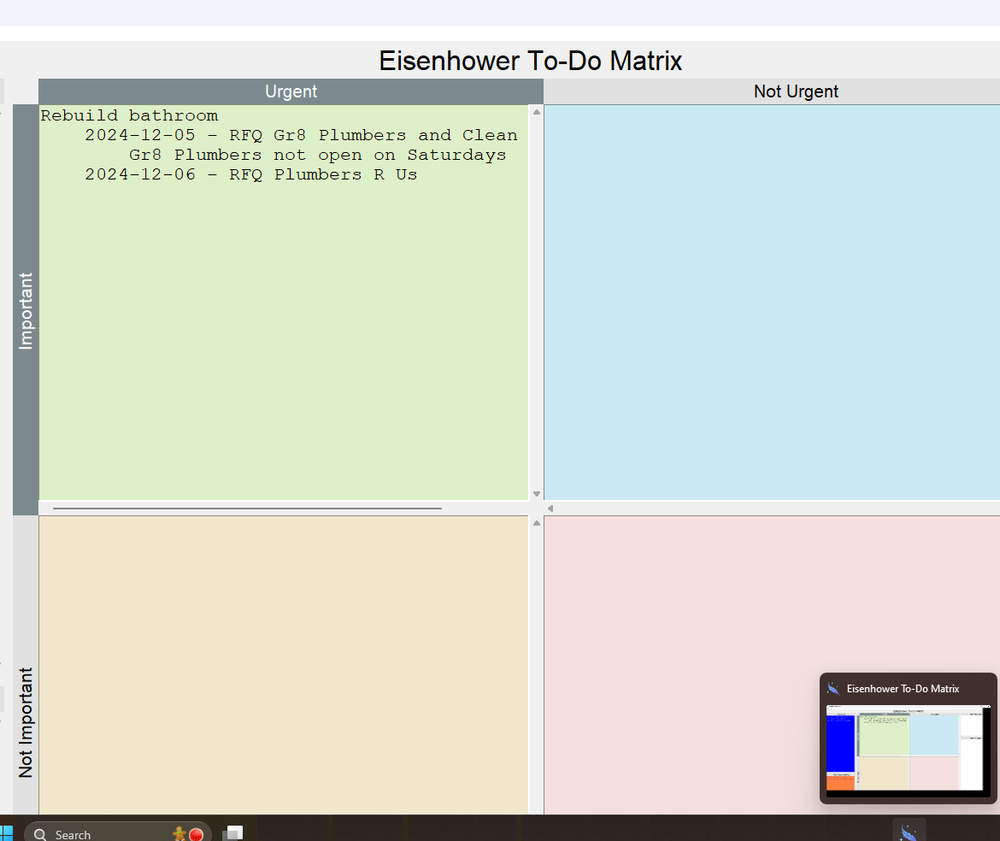

# Extended Eisenhower To-Do Matrix



Now more than ever there is a demand for focused time management. Dwight D Eisenhower developed a to-do matrix that categorizes tasks by either important or not important and urgent or not urgent. This creates four discrete categories that are traditionally labeled as "Do" (Important and Urgent), "Schedule" (Important but Not Urgent), "Delegate" (Not Important but Urgent), and "Delete" (Neither Important nor Urgent). Treating this matrix as a living document can assist in time management, helping to prioritize what needs worked on when it needs worked on.

The heart of this project is the Eisenhower To-Do Matrix. I have added additional customizable note sections to the sides to attempt to catch all use cases and extend the functionality of the matrix so that it may be a central power hub for personal time management.

## Getting Started

The application is written Python 3's Standard Library. The only necessary files to run the application are Eisenhower.py, Settings.py, Styles.py, and the images/ folder. These files and this folder must all be in the same location on your computer.

Open Eisenhower.py with python 3 to run the application. It is recommended to use the `pythonw` command so that a terminal window does not open.

## Basics

This application is made of eight free-form text boxes. By keeping the entry boxes simple, it is easier to copy, paste, and organize as needed. You may use the tab key to help organize (adjust tab width in settings).



Any entry into the application or setting change marks the matrix as unsaved. You can always know whether the matrix is saved by the flag in the top left that says "CHANGES NOT SAVED." 



Use File --> Save or CTRL+S to save your Eisenhower To-Do Matrix. Once the matrix is saved, the CHANGES NOT SAVED flag disappears. 

The save file is a JSON file that stores the contents of each of the text boxes as well as the settings.

## Settings



You may change the headers of the side notes, the coloring of all of the text boxes (background and foreground), and you may also change the font size or the tab width to what suits your needs best. 



Settings are not universal. Settings belong to the matrix save itself.

## Shortcuts

If you will be regularly working with the same matrix, it can be helpful to create a shortcut to automatically open that specific matrix. You may pass the file name as the second parameter to Python to open the file directly. Use `pythonw` instead of `python` so that only the Tkinter (GUI) window opens. Otherwise, a terminal window will open in the background and will close your matrix when it is closed.

```
pythonw "[path_to_Eisenhower.py]" "[path_to_document.ei]"
```

For example, in Windows, right click the file. If in Windows 11, click on "Show more options." Click on "Create shortcut."



Right click the new shortcut and click on "Properties."

In this example, my Target field reads the below.

```
pythonw "C:\Users\zygat\Eisenhower\Eisenhower.py" "C:\Users\zygat\Eisenhower\example.ei"
```



Now, that shortcut will open the example.ei document directly. I like to add the shortcut then to my taskbar for easy access.



## Resources

Thank you to Freepik at Flaticon for the icons used for this application. Find them at the link below.

<a href="https://www.flaticon.com/free-icons/magic" title="magic icons">Magic icons created by Freepik - Flaticon</a>